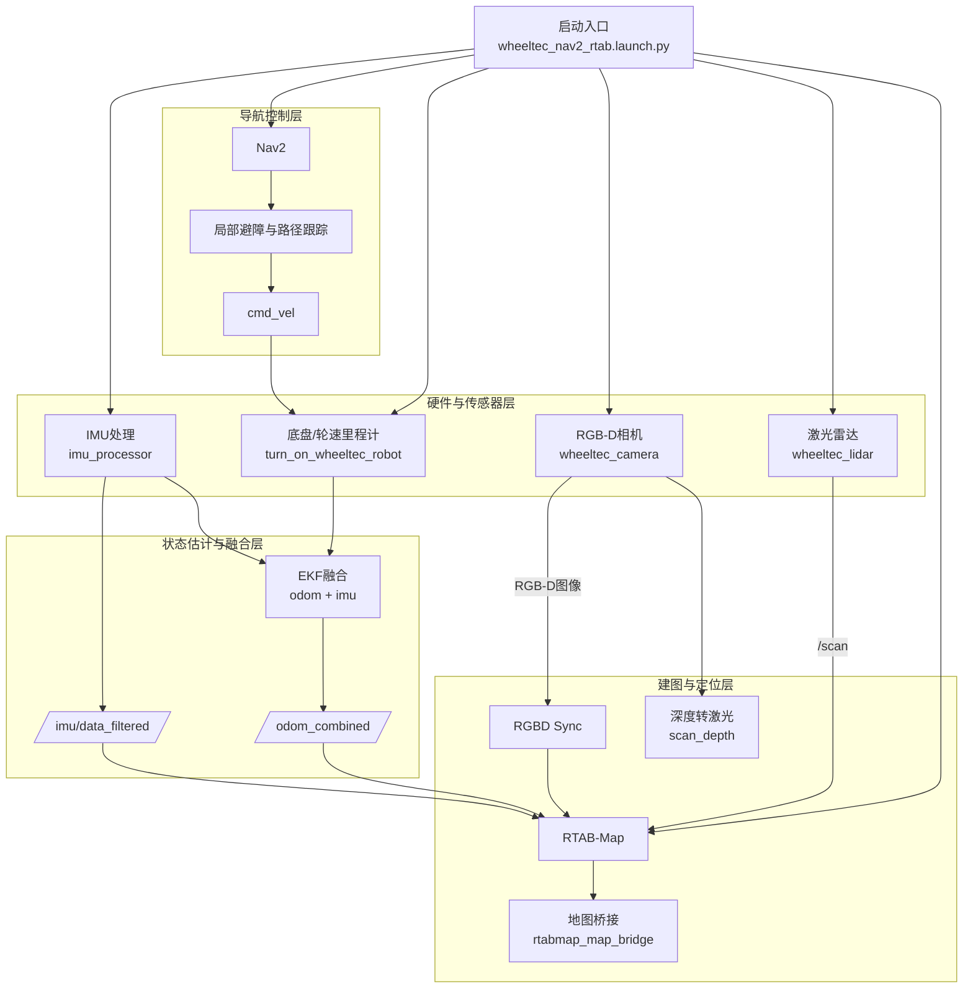
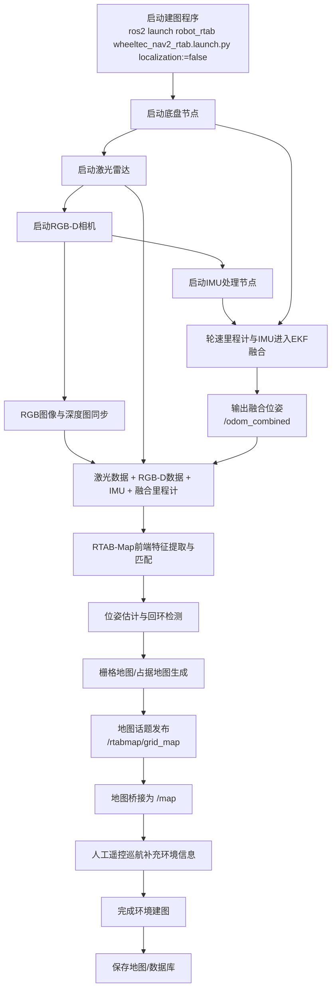
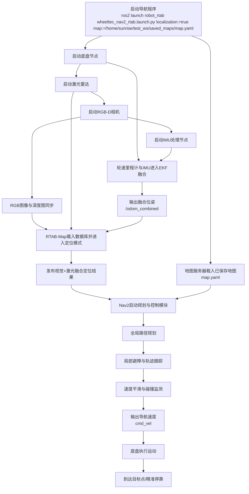

# 建图程序框架图

## 1. 程序框架图

## 2. 建图流程图

## 3. 导航流程图

## 4. 说明

- 建图模式：`localization:=false`
- 导航模式：`localization:=true`
- 建图时通常由人工遥控机器人运动，RTAB-Map实时完成环境感知、位姿估计和地图更新
- 导航时由RTAB-Map提供定位，Nav2负责全局规划、局部避障、速度控制和到点停车
